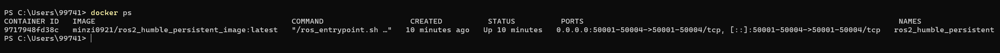

# 我的ROS2学习之旅
作者：Minzi

## Week1： ROS2入门与基础概念
- 学习内容：ROS2 tutorials第一和第二章

## Week2：UR3机械臂仿真
- 学习内容：
  1. 学习并安装UR的ROS 2驱动（ur_robot_driver）
  2. 在可视化工具Rviz中看到一个UR3模型
  3.  熟悉Rviz和TF2
  4. 创建了一个package，可以控制rviz中的仿真ur3机械臂循环前往不同的轨迹点

## Week3：连接ur3真机，利用Moveit2规划轨迹
工作记录：

日期：20250926

### 第一步：环境准备
1. 创建一个新的容器，并创建新的工作空间，配置github SSH连接
2. 安装必要的ROS 2包
```
# 确保你的apt包列表是最新的
sudo apt update

# 安装UR的ROS 2驱动
sudo apt install ros-humble-ur-robot-driver

# 安装MoveIt 2核心库
sudo apt install ros-humble-moveit

# 安装UR机械臂的MoveIt配置包
sudo apt install ros-humble-ur-moveit-config
```
    说明：ur-robot-driver负责底层通信，moveit是运动规划框架，ur-moveit-config则包含了UR3的3D模型、关节限制、运动学求解器等配置文件，告诉MoveIt“我们正在使用UR3这台机器人”。
3. 创建我们自己的功能包

    现在，在src目录下创建我们自己的功能包，用来存放直线运动控制的Python脚本。
```bash
cd ~/workspaces3/src
ros2 pkg create --build-type ament_python ur3_moveit_control
```
### 第二步：连接并配置真实UR3机械臂

1. 配置真实的UR3机械臂
    
    为UR3机械臂安装URCaps External Control
    > 从[Universal_Robots_ROS2_Driver](https://github.com/UniversalRobots/Universal_Robots_ROS2_Driver.git) 的/ur_robot_driver/resources 文件夹下下载externalcontrol-1.0.5.urcap文件
    > 将此文件拷贝到U盘，插入UR示教器，在示教器上，进入`设置 ->URCaps`，点击`+`号从U盘文件中添加这个URCap，然后根据提示重启机械臂

2. 经检测不能连接艾目易定位仪，为艾目易定位仪更新驱动

    根据技术支持工程师的指导，按照驱动更新说明书操作：

    [驱动安装说明书](./assets/学习记录/2.AimPosition光学定位系统驱动安装说明书V2.2.pdf)

#### 日期：20250927
  1. 重建新的容器

      在启动脚本处添加参数：`--network host`

      这样容器就和主机处于同一网络，可以直接访问机械臂
      创建新容器需要重新配置github ssh
  2. 配置机械臂IP地址
   
      - 确保主机与机械臂的网线连接正确插入
      - 设置了机械臂的IP地址为169.254.1.8
      - 在主机的以太网适配器中，设置IPv4地址为169.254.1.9
      - 安装ping工具，测试ping通

      ```
      sudo apt update && sudo apt install iputils-ping -y

      root@docker-desktop:/ros2_workspaces# ping 169.254.1.8
      PING 169.254.1.8 (169.254.1.8) 56(84) bytes of data.
      64 bytes from 169.254.1.8: icmp_seq=1 ttl=64 time=1.78 ms
      64 bytes from 169.254.1.8: icmp_seq=2 ttl=64 time=1.43 ms
      64 bytes from 169.254.1.8: icmp_seq=3 ttl=64 time=2.77 ms
      64 bytes from 169.254.1.8: icmp_seq=4 ttl=64 time=3.30 ms
      64 bytes from 169.254.1.8: icmp_seq=5 ttl=64 time=2.02 ms
      64 bytes from 169.254.1.8: icmp_seq=6 ttl=64 time=2.58 ms
      64 bytes from 169.254.1.8: icmp_seq=7 ttl=64 time=1.38 ms
      ```

  3. 在容器中安装 UR ROS2 驱动（官方推荐）
      
      - 克隆源码仓库

      ```
        cd workspaces3/src
        git clone -b humble https://github.com/UniversalRobots/Universal_Robots_ROS2_Driver.git
        git clone -b humble https://github.com/UniversalRobots/Universal_Robots_ROS2_Description.git
      ```

      - 安装控制器（已包含在 driver 中，但确保依赖完整）

      ```
      sudo apt update
      sudo apt install ros-humble-ros2-control ros-humble-ros2-controllers \
                 ros-humble-joint-trajectory-controller \
                 ros-humble-velocity-controllers
      ```

      - 安装MoveIt2

      ```
      sudo apt install ros-humble-moveit
      ```

      - 编译文件
      ```
      cd workspace3
      colcon build --symlink-install
      source install/setup.bash
      ```

      - `colcon build --symlink-install`报错了

        - 原因：

          a. 没有`source /opt/ros/humble/setup.bash`
          
          b. 缺少了一部分的系统依赖包

        - 解决：
          - 在~/.bashrc中添加`source /opt/ros/humble/setup.bash`

          ```
          echo "source /opt/ros/humble/setup.bash" >> ~/.bashrc 
          ```
          - 使用rosdep自动安装所有包所声明的系统依赖
          ```
          确保能连接github
          rosdep init(通常不需要)
          rosdep update
          rosdep install --from-paths src --ignore-src -r -y
          ```
          安装所有依赖后重新进行编译

  4. 链接UR3机械臂实机

      - 启动实机驱动

        ```
        source install/setup.bash

        ros2 launch ur_bringup ur_control.launch.py \
        ur_type:=ur3 \
        robot_ip:=192.168.56.101 \
        use_fake_hardware:=false \
        launch_rviz:=true
        ```
      
      - 报错了
        - 测试`ros2 run turtlesim turtlesim_node`也无反应
        - 判断原因：没能正确创建Xlaunch显示窗口，是因为容器启动脚本中的DISPLAY参数写错了，应该写当前电脑的ip
        - 查看ip的方法，使用WSL的ipv4地址，不同电脑不一样

          ```
          ipconfig
          
          以太网适配器 vEthernet (WSL (Hyper-V firewall)):

          连接特定的 DNS 后缀 . . . . . . . :
          本地链接 IPv6 地址. . . . . . . . : fe80::ef6e:8951:77a9:41f3%47
          IPv4 地址 . . . . . . . . . . . . : 172.27.128.1
          子网掩码  . . . . . . . . . . . . : 255.255.240.0
          默认网关. . . . . . . . . . . . . :
          ```
        - 修改后重建容器能正确运行turtlesim_node了
        - 新建容器需要重新安装依赖
        - 成功了！

### 第三步：利用Moveit2 + Pilz Industrial Motion Planner实现UR3的直线运动控制

  1. 安装Pilz Planner

      MoveIt 2默认的规划器是      OMPL (Open Motion Planning Library)，它非常强大，擅长在复杂的、有障碍物的环境中找到一条可行的路径 。但它的规划结果有时是“绕来绕去”的曲线，对于工业应用中常见的、要求高精度的直线或圆弧运动，OMPL不一定能生成最理想的轨迹。

      Pilz Industrial Motion Planner 就是为了解决这个问题而生的。它是一个专门为MoveIt 2设计的规划器插件，专注于生成工业机器人中最常见的三种运动：

      - PTP (Point-to-Point)：点到点运动，只关心起点和终点，中间路径由规划器优化。

      - LIN (Linear)：直线运动。这是你最关心的，它能确保机械臂末端在空间中走出一条笔直的线段。

      - CIRC (Circular)：圆弧运动。

      Pilz的核心优势在于：

      - 确定性和可预测性：对于直线运动，Pilz生成的路径就是一条直线，非常可靠。

      - 速度和加速度控制：Pilz在规划路径的同时，会生成平滑的速度和加速度曲线，确保机械臂运动平稳，这对于焊接、涂胶、装配等工业任务至关重要。

      - 易于使用：一旦配置好，请求一次直线运动就变得非常简单。

#### 日期：2025.9.28

- 在电脑上运行moveit后不能连接到机械臂

- 判断是容器端口没开放的问题，需要开放50001，50002，50003，50004端口

- 改写容器启动脚本，具体内容详见[启动容器的脚本](./启动容器的脚本.md)
  - 针对上述问题，主要是在容器启动时添加了开放端口的参数

- 尝试用自己的电脑重新搭建环境，放弃105的电脑了

- 在容器中安装ping工具

    ```
    apt update && apt install -y iputils-ping
    ```

- 启动实机驱动

    ```bash
        source install/setup.bash

        ros2 launch ur_robot_driver ur_control.launch.py ur_type:=ur3 robot_ip:=192.168.56.101 kinematics_params_file:="/ros2_workspaces/workspaces3/ur3_calibration.yaml" reverse_ip:=192.168.56.1 
    ```
    - rviz 界面显示RobotModel状态错误，不能正常读取机器人信息
    - ur示教器中运行external control 报告“编译错误，发现一个表达式...”
        
        - 原因：电脑上没有运行控制程序 
  
- 停用示教器中多余的URCaps程序，并将示教器中external control设置的hostname设置为docker-desktop，又重新创建容器，再搭建环境，运行ur_bringup又可以了

- 容器启动脚本中需要删除`--network host ^`才能正常映射端口50001 ->50004

开放端口后尝试运行
```bash
ros2 launch ur_moveit_config ur_moveit.launch.py ur_type:=ur3 robot_ip:=192.168.56.101 reverse_ip:=192.168.56.1 
```

#### 日期：2025.9.30

成功用moveit控制机械臂运动了！

总结用ROS2控制UR3机械臂的步骤：

1. 配置机械臂

  - 设置了机械臂的IP地址为192.168.56.101
  - 安装 External Control URCaps
      
    > - 从[Universal_Robots_ROS2_Driver](https://github.com/UniversalRobots/Universal_Robots_ROS2_Driver.git) 的/ur_robot_driver/resources 文件夹下下载externalcontrol-1.0.5.urcap文件
    > - 将此文件拷贝到U盘，插入UR示教器，在示教器上，进入`设置 ->URCaps`，点击`+`号从U盘文件中添加这个URCap，然后根据提示重启机械臂 
    > - 建议停用示教器中的其他URCap，可能会导致干扰
    > - 进入 `安装 ->URCaps` 提前设置好`host IP`（要求前三位和机械臂IP相同，即在同一网段，最后一位不可以相同），将`host name`设置为`docker-desktop`(这是docker容器的默认名字)

2. 配置容器启动参数和网络
    - 连接机械臂的网线，设置IPv4地址与机械臂在同一网段

      > IPV4: 192.168.56.1(机械臂ip：192.168.56.101)
      > 子网掩码：255.255.255.0

    - 创建Docker容器，确保容器网络配置正确，能访问机械臂IP
      - 在容器启动脚本中映射必要端口（50001-50004）
        ```bash
        -p 50001 ^
        -p 50002 ^
        -p 50003 ^
        -p 50004 ^
        ```
      
        设置完成后通过`docker ps`，在PORTS列中查看容器映射了哪些端口 
         
        

    - 在容器启动脚本中不要使用`--network host`！否则会阻止端口映射

  - 配置github-SSH连接 [github链接ssh](github链接ssh.md)

3. 配置容器内环境与依赖

  - 向~/.bashrc 添加`source /opt/ros/humble/setup.bash`
  ```
  echo "source /opt/ros/humble/setup.bash" >> ~/.bashrc
  ```
  - 安装UR机械臂相关驱动
  ```bash
  sudo apt update
  sudo apt install  ros-humble-ur\
                    ros-humble-ur-robot-driver\
                    ros-humble-moveit\
                    ros-humble-ur-moveit-config
                    ros-humble-ros2-control \ 
                    ros-humble-ros2-controllers \
                    ros-humble-joint-trajectory-controller \
                    ros-humble-velocity-controllers \
  ```
  - 克隆UR机械臂驱动源代码仓库

  ```
  cd {workspace}/src 
  git clone -b humble https://github.com/UniversalRobots/Universal_Robots_ROS2_Driver.git
  git clone -b humble https://github.com/UniversalRobots/Universal_Robots_ROS2_Description.git
  ```
  - 使用rosdep自动安装所有包所声明的系统依赖
  ```
  rosdep init(一般会由系统自动执行，手动执行会报错，可以忽略)
  rosdep update
  rosdep install --from-paths src --ignore-src -r -y
  ```
  - 编译程序包
  `colcon build --symlink-install`

4. 连接UR3机械臂实机

- 在容器中安装ping工具并测试能否与机械臂IP地址通讯
    ```
    apt update && apt install -y iputils-ping

    ping <机器人IP>（在本例中为192.168.56.101）
    ```
    联通的情况下会输出以下信息
    ```
      root@docker-desktop:/ros2_workspaces# ping 192.168.56.101
      PING 192.168.56.101 (192.168.56.101) 56(84) bytes of data.
      64 bytes from 192.168.56.101: icmp_seq=1 ttl=64 time=1.78 ms
      64 bytes from 192.168.56.101: icmp_seq=2 ttl=64 time=1.43 ms
      64 bytes from 192.168.56.101: icmp_seq=3 ttl=64 time=2.77 ms
      64 bytes from 192.168.56.101: icmp_seq=4 ttl=64 time=3.30 ms
      64 bytes from 192.168.56.101: icmp_seq=5 ttl=64 time=2.02 ms
      64 bytes from 192.168.56.101: icmp_seq=6 ttl=64 time=2.58 ms
      64 bytes from 192.168.56.101: icmp_seq=7 ttl=64 time=1.38 ms
    ```
- 提取机械臂校准信息
  每台UR机器人在工厂内部进行了校准，提供了精确的正向和逆向运动学。为了在ROS中也利用这一点，我们首先需要从机器人中提取校准信息。运行以下代码

  ```
  ros2 launch ur_calibration calibration_correction.launch.py \
  robot_ip:=<robot_ip> target_filename:="my_robot_calibration.yaml"
  ```
  结果是在当前文件夹下创建一个`my_robot_calibration.yaml`文件，记下这个文件的**绝对路径**，后续要用

- 启动 Universal Robots (UR) 机械臂在 ROS 2 中的底层控制节点

  ```bash
  source install/setup.bash

  ros2 launch ur_robot_driver ur_control.launch.py \
      ur_type:=ur3 \
      robot_ip:=192.168.56.101 \
      kinematics_params_file:="/ros2_workspaces/workspaces3/ur3_calibration.yaml" \
      reverse_ip:=192.168.56.1
  ```

  |参数|说明|
  |---|---|
  |ur_type:=ur3|指定机械臂型号为 UR3。驱动会加载对应的 URDF、限制参数（速度、加速度等）和默认配置。|
  |robot_ip:=192.168.56.101|UR 控制器的 IP 地址。ROS 2 主机将通过此地址与机械臂通信（需确保网络连通）。|
  |kinematics_params_file:=...|指向一个 YAML 格式的 校准后 **DH 参数文件**。用于替代 UR 默认的运动学模型，提升精度（通常通过 UR 自动校准工具生成）。|
  |reverse_ip:=192.168.56.1|**ROS 2 主机的 IP 地址**。UR 控制器会主动连接此 IP 的 50001/50002 端口（用于实时控制和状态反馈）。必须设置正确，否则连接会失败。|

  运行代码后会出现一个Rviz界面，里面会有与UR3实际状态一致的虚拟机械臂，会随着真实机械臂运动而改变

- 在机械臂示教器中运行External Control
  - 在示教器的程序面板中添加URCaps -> External Control节点
  - 点击右下角的运行按钮，如果正常运行且没有报错，则可以进行下一步
  - 如果报错，则检查以下几点
      
      - 机械臂IP和电脑IP是否在同一网段
      - 检查容器的50001、50002、50003、50004端口是否开放并正常映射
      - 容器和主机的网络防火墙是否已经关闭  
- 在新的终端测试能否正常控制

    ```bash
    source install/setup.bash

    ros2 launch ur_robot_driver test_scaled_joint_trajectory_controller.launch.py
    ```
    如果机械臂能运动，证明连接成功了！

- 在新的终端运行Moveit！执行以下代码
    ```bash
    source install/setup.bash

    ros2 launch ur_moveit_config ur_moveit.launch.py ur_type:=ur3 robot_ip:=192.168.56.101 reverse_ip:=192.168.56.1 
    ```
  此举会创建一个新的Rviz界面，并能看到Motion Planning页面
  可以尝试使用moveit的基本方法控制机械臂了！
  


      


