# ROS2正确连接使用moveit控制ur机械臂实机步骤

作者：Minzi

总结用ROS2控制UR3机械臂的步骤：

1. 配置机械臂

  - 在示教器上设置机械臂的IP地址为192.168.56.101
  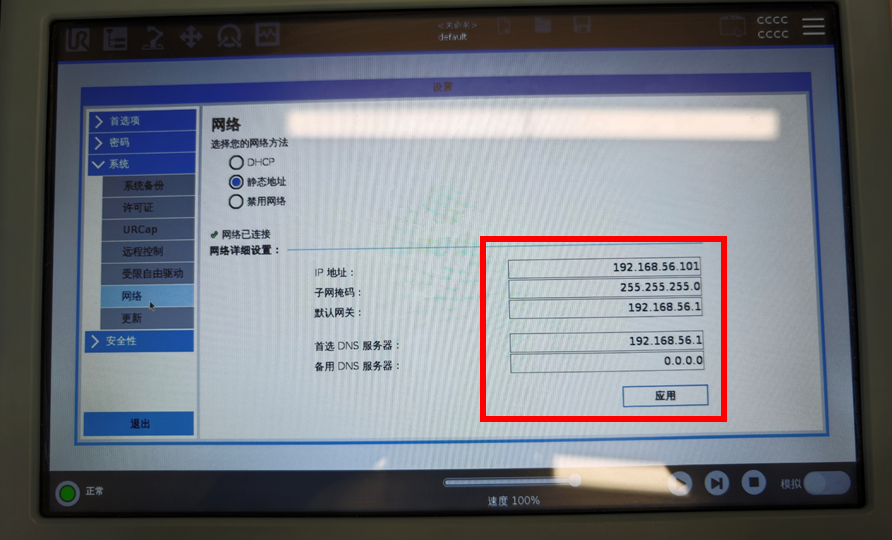
  - 安装 External Control URCaps
      
    > - 从[Universal_Robots_ROS2_Driver](https://github.com/UniversalRobots/Universal_Robots_ROS2_Driver.git) 的/ur_robot_driver/resources 文件夹下下载externalcontrol-1.0.5.urcap文件
    > - 将此文件拷贝到U盘，插入UR示教器，在示教器上，进入`设置 ->URCaps`，点击`+`号从U盘文件中添加这个URCap，然后根据提示重启机械臂 
    > - 建议停用示教器中的其他URCap，可能会导致干扰

    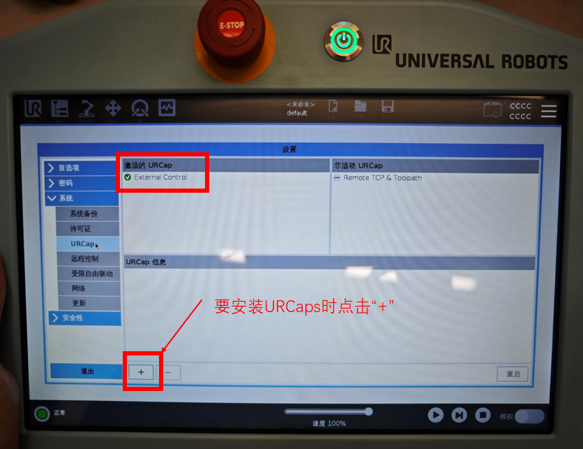

    > - 进入 `安装 ->URCaps` 提前设置好`host IP`（要求前三位和机械臂IP相同，即在同一网段，最后一位不可以相同），将`host name`设置为`docker-desktop`(这是docker容器的默认名字)

    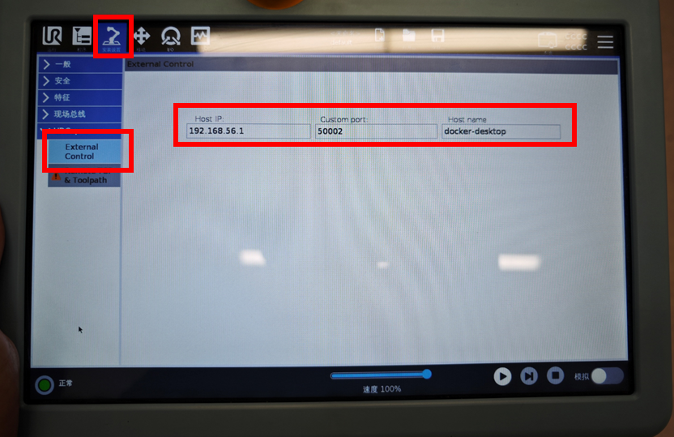

2. 配置容器启动参数和网络
    - 连接机械臂的网线，设置IPv4地址与机械臂在同一网段

      > IPV4: 192.168.57.1(机械臂ip：192.168.57.101)
      > 子网掩码：255.255.255.0
    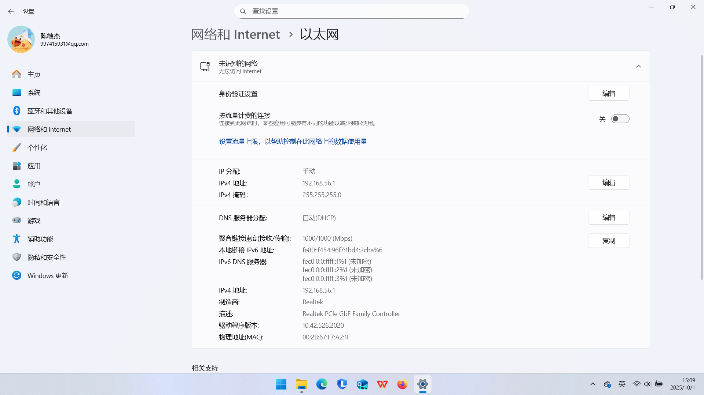
    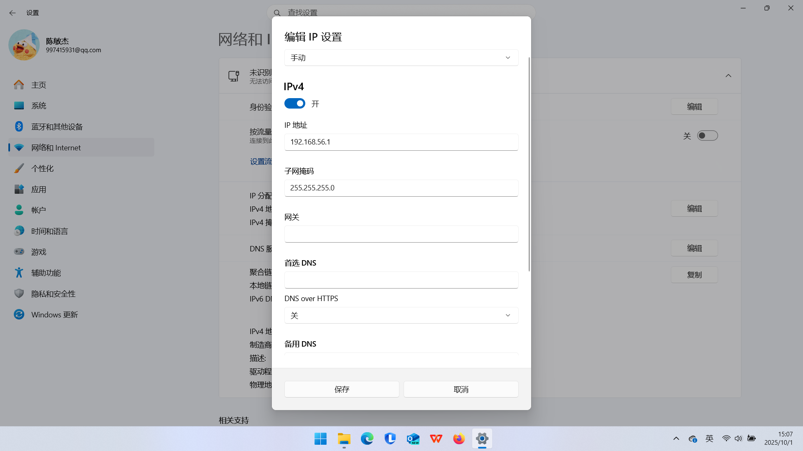
    - 创建Docker容器，确保容器网络配置正确，能访问机械臂IP
      - 在容器启动脚本中映射必要端口（50001-50004）
        ```bash
        -p 50001 ^
        -p 50002 ^
        -p 50003 ^
        -p 50004 ^
        ```
      > 容器启动脚本可参考[容器启动的脚本.md](启动容器的脚本.md) 

        设置完成后通过`docker ps`，在PORTS列中查看容器映射了哪些端口 
        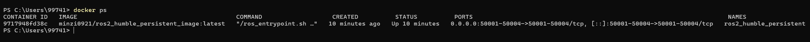 
        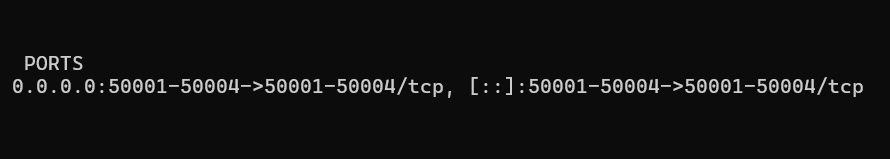

    - 在容器启动脚本中不要使用`--network host`！否则会阻止端口映射

  - 配置github-SSH连接 [github链接ssh](github链接ssh.md)

3. 配置容器内环境与依赖

  - 向~/.bashrc 添加`source /opt/ros/humble/setup.bash`
  ```
  echo "source /opt/ros/humble/setup.bash" >> ~/.bashrc
  ```
  - 安装UR机械臂相关驱动
  ```bash
  sudo apt update
  sudo apt install -y ros-humble-ur\
                    ros-humble-ur-robot-driver\
                    ros-humble-moveit\
                    ros-humble-ur-moveit-config \
                    ros-humble-ros2-control \
                    ros-humble-ros2-controllers \
                    ros-humble-joint-trajectory-controller \
                    ros-humble-velocity-controllers 
  注 \ 后不能有空格
  ```


4. 连接UR3机械臂实机

- 在容器中安装ping工具并测试能否与机械臂IP地址通讯
    ```
    apt update && apt install -y iputils-ping

    ping <机器人IP>（在本例中为192.168.56.101）
    ```
    联通的情况下会输出以下信息
    ```
      root@docker-desktop:/ros2_workspaces# ping 192.168.56.101
      PING 192.168.56.101 (192.168.56.101) 56(84) bytes of data.
      64 bytes from 192.168.56.101: icmp_seq=1 ttl=64 time=1.78 ms
      64 bytes from 192.168.56.101: icmp_seq=2 ttl=64 time=1.43 ms
      64 bytes from 192.168.56.101: icmp_seq=3 ttl=64 time=2.77 ms
      64 bytes from 192.168.56.101: icmp_seq=4 ttl=64 time=3.30 ms
      64 bytes from 192.168.56.101: icmp_seq=5 ttl=64 time=2.02 ms
      64 bytes from 192.168.56.101: icmp_seq=6 ttl=64 time=2.58 ms
      64 bytes from 192.168.56.101: icmp_seq=7 ttl=64 time=1.38 ms
    ```
- 提取机械臂校准信息
  每台UR机器人在工厂内部进行了校准，提供了精确的正向和逆向运动学。为了在ROS中也利用这一点，我们首先需要从机器人中提取校准信息。运行以下代码

  ```
  ros2 launch ur_calibration calibration_correction.launch.py \
  robot_ip:=<robot_ip> target_filename:="my_robot_calibration.yaml"
  ```
  结果是在当前文件夹下创建一个`my_robot_calibration.yaml`文件，记下这个文件的**绝对路径**，后续要用

  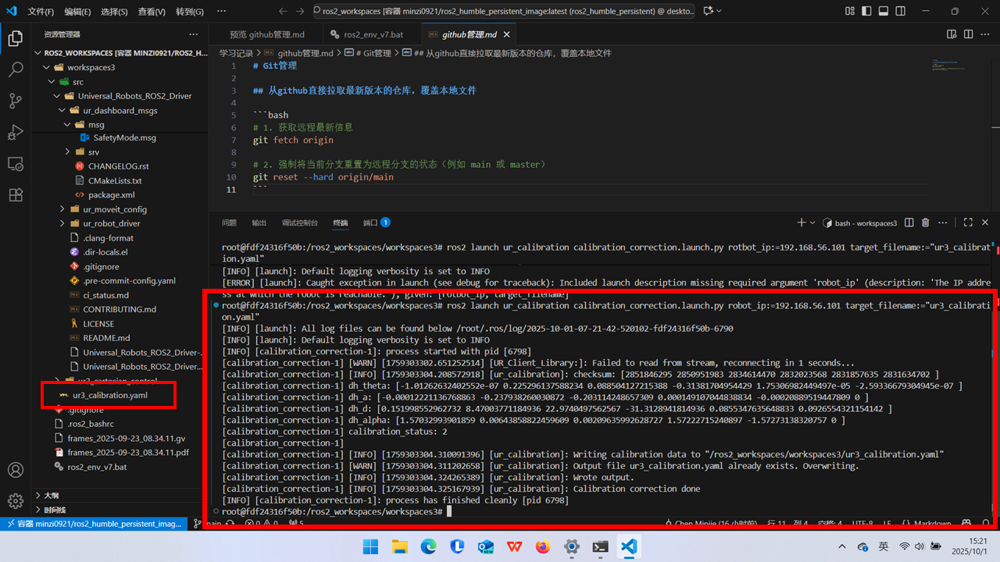

- 启动 Universal Robots (UR) 机械臂在 ROS 2 中的底层控制节点

  ```bash
  source install/setup.bash

  ros2 launch ur_robot_driver ur_control.launch.py \
      ur_type:=ur3 \
      robot_ip:=192.168.56.101 \
      kinematics_params_file:="/ros2_workspaces/workspaces3/ur3_calibration.yaml" \
      reverse_ip:=192.168.56.1 \
      launch_rviz:=false
      reverse_ip:=192.168.56.1 \
      launch_rviz:=false
  ```

  - 参数说明
  > `ur_type:=ur3` ：指定机械臂型号为 UR3。驱动会加载对应的 URDF、限制参数（速度、加速度等）和默认配置。
  > `robot_ip:=192.168.56.101`：UR 控制器的 IP 地址。ROS 2 主机将通过此地址与机械臂通信（需确保网络连通）。
  > `kinematics_params_file:=...`：指向一个 YAML 格式的 校准后 **DH 参数文件**。用于替代 UR 默认的运动学模型，提升精度（通常通过 UR 自动校准工具生成）。
  > `reverse_ip:=192.168.56.1`：**ROS 2 主机的 IP 地址**。UR 控制器会主动连接此 IP 的 50001/50002 端口（用于实时控制和状态反馈）。必须设置正确，否则连接会失败。

  运行代码后会出现一个Rviz界面，里面会有与UR3实际状态一致的虚拟机械臂，会随着真实机械臂运动而改变
  > 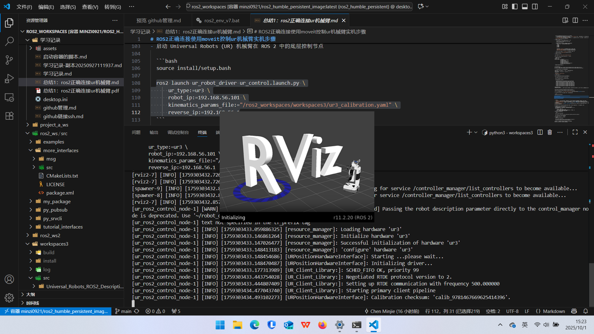
  > 
  
- 在机械臂示教器中运行External Control
  - 在示教器的程序面板中添加URCaps -> External Control节点
  - 点击右下角的运行按钮，如果正常运行且没有报错，则可以进行下一步
  - 如果报错，则检查以下几点
      
      - 机械臂IP和电脑IP是否在同一网段
      - 检查容器的50001、50002、50003、50004端口是否开放并正常映射
      - 容器和主机的网络防火墙是否已经关闭  

  > 
  - 如果连接成功，终端应输出以下信息
  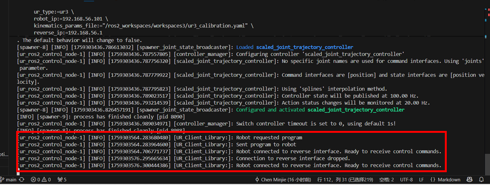

- 在新的终端测试能否正常控制

    ```bash
    source install/setup.bash

    ros2 launch ur_robot_driver test_scaled_joint_trajectory_controller.launch.py
    ```
    如果机械臂能运动，证明连接成功了！


- 在新的终端运行Moveit！执行以下代码
    ```bash
    source install/setup.bash

    ros2 launch ur_moveit_config ur_moveit.launch.py ur_type:=ur3 \
    robot_ip:=192.168.56.101 reverse_ip:=192.168.56.1 
    ```
  此举会创建一个新的Rviz界面，并能看到Motion Planning页面
  可以尝试使用moveit的基本方法控制机械臂了！
  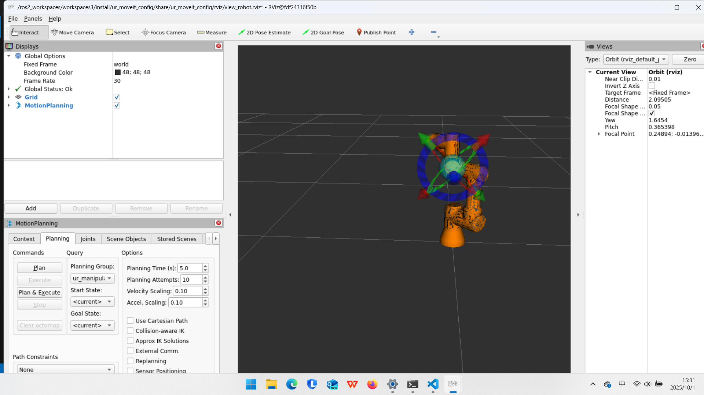

## 注：务必按照以下顺序启动程序

`ur_robot_driver` -> `External Control` -> `ur_moveit_config`

否则会出现不能运动的错误

若示教器中External Control已经运行，需要将其退出后重新按照以上顺序启动程序


## 尝试在远程模式启动机械臂ros控制

步骤：
```
  source /opt/ros/humble/setup.bash

  ros2 launch ur_robot_driver ur_control.launch.py \
      ur_type:=ur3 \
      robot_ip:=192.168.56.101 \
      kinematics_params_file:="/ros2_workspaces/workspaces3/ur3_calibration.yaml" \
      reverse_ip:=192.168.56.1 \
      launch_rviz:=false

  **启动external control urcaps：**
  
  开启新的终端
  source /opt/ros/humble/setup.bash

  ros2 service call /dashboard_client/connect std_srvs/srv/Trigger {}
  ros2 service call /dashboard_client/load_program ur_dashboard_msgs/srv/Load "filename: external_control.urp"
  ros2 service call /dashboard_client/play std_srvs/srv/Trigger {}
  ros2 service call /dashboard_client/stop std_srvs/srv/Trigger {}

  ros2 service call /dashboard_client/program_running ur_dashboard_msgs/IsProgramRunning {}

  ros2 launch ur_moveit_config ur_moveit.launch.py ur_type:=ur3 \
    robot_ip:=192.168.56.101 reverse_ip:=192.168.56.1
```